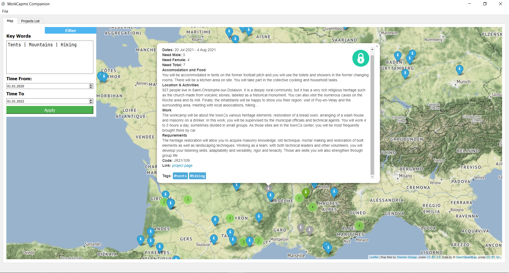

# work_camps_search
The application is created to facilitate the search for WorkCamps. 

[E-vet workcamps page](https://www.e-vet.org/fo/html5/index.cfm?e04=250735&qs=style2&dil=eng) provides more than 1000 projects (for Belarus people). But it is provided in list format with no save possibility, no keywords search, no location provided on map.

App's scope:
  - **Parse projects** from link above.
  - **Define coordinates** by info provided in projects fields and from context of description.
  - Visualize all info on **map**.
  - Provide **save ability**.
  - Provide ability to see new projects coming and see what you **already watched**.
  - Search by **Keywords**
  




## Installation 
0) Install `python3.7`

2) Download the repo (*Or you can download the repo as .zip file*):
```bash
git clone https://github.com/IgorHoholko/work_camps_search.git
cd work_camps_search
```

3) Install requared packages:
```bash
pip install -r requarements
```

## Run
First go to [e-vet workcamps page](https://www.e-vet.org/fo/html5/index.cfm?e04=250735&qs=style2&dil=eng), select countries you want and press *PROCEED TO RESULT*. 
After that save the page you got with `Ctrl+S` to the  root directory of the project (or anywhere you want, just specify the path in args then). 

Run: 
```bash
python -m run_app -i <page you saved>
```
> You can specify other args (run `python -m run_app -h` to see them). Better to use default ones.


## Demonstration
See projects in a convenient format, save them and see what you already watched. All info will be saved after you Quit the app.


Search camps by KeyWords:


